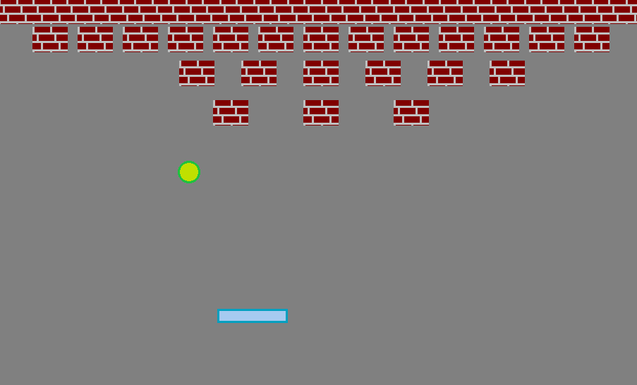
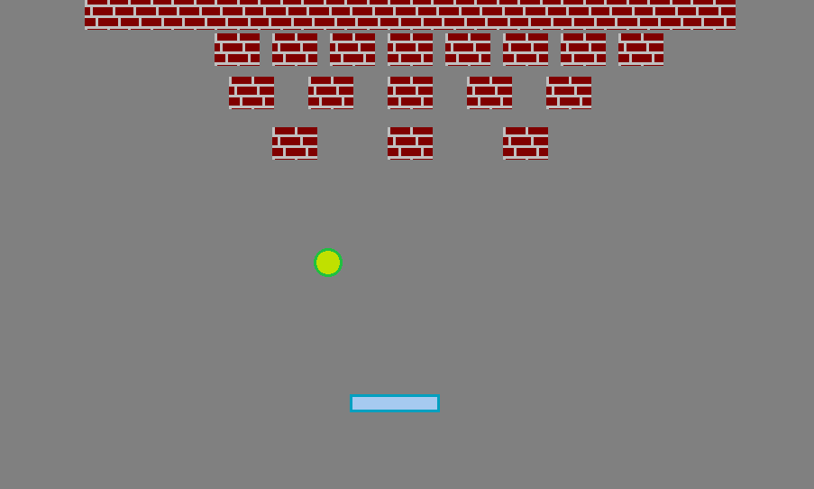
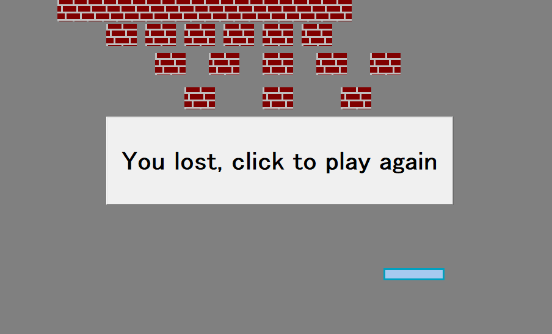

# MiniArkanoid
MiniArkanoid to zręcznościowa gra akcji.

## General Information
Sterujemy małą paletką, którą odbijamy piłeczkę.\
Piłeczka może niszczyć cegły odktórych się odbije.\

W ten sposób należy zniszczyć wszystkie cegły bez pozwolenia, by piłeczka spadła pod peletkę.

## Technology 
 Aplikacja napisana w programie:
* C++ Builder 6

 Język programowania:
* C++
## Screenshots

## Setup
 W celu uruchomienia aplikacji należy uruchomić plik "MiniArkanoid.exe" lub "Project2.exe".  
 
## Usage
 Program został stworzony jedynie w celu rozrowykowym.  
 
